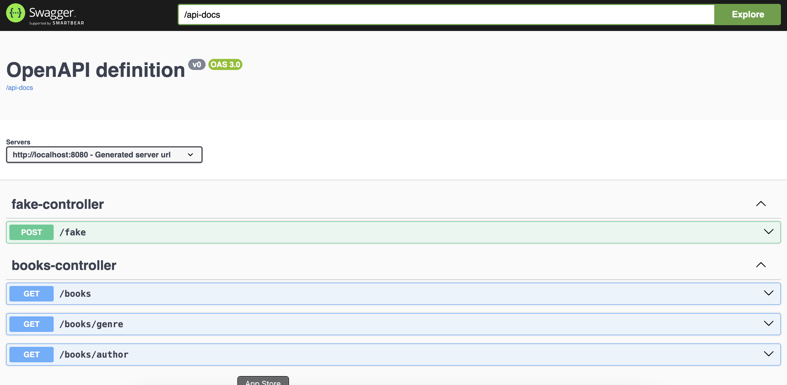

# Wise's Catalog API - Uma API REST em Java com Spring Boot

Este documento fornece um guia para o entendimento da construção da  API REST desenvolvida em Java utilizando o framework Spring Boot. 
Ele abrange a arquitetura da solução, detalhes de implementação e considerações finais, proporcionando uma visão clara e concisa do projeto.


## Índice

- 1. Arquitetura de Solução e Arquitetura Técnica
  - Descrição da Solução
  - Tecnologias Utilizadas
  - Decisões de Design
- 2. Explicação sobre o Case Desenvolvido (Plano de Implementação)
  - Lógica de Negócios
  - Estrutura de Dados
  - Endpoints da API
    - Explicando a Implementação do Controller
    - Explicando a Implementação do Service
  - Como testar a aplicação
    - Docker-Compose
    - Povoando o banco
- 3. Melhorias e Considerações Finais
  - Possíveis Melhorias
  - Desafios Encontrados
- 4. Conclusão

## 1. Arquitetura de Solução e Arquitetura Técnica

Foi escolhido um padrão de projeto onde os serviços estão em camadas, o que colabora na realização de um dos princípios 
SOLID, que é de responsabilidade única das funções.
   
### Descrição da Solução

A API REST foi desenvolvida para resgatar livros de uma livraria fictícia, com base em parâmetros de gênero, autor e buscas por ids, assim como buscas paginadas. 
Ela permite que clientes consumam e interajam com os dados de maneira eficiente, seguindo os princípios RESTful.

### Tecnologias Utilizadas

- Java 21: Linguagem de programação utilizada para o desenvolvimento da API.
- Spring Boot: Framework que simplifica a criação de aplicações standalone de produção em Spring.
- Spring Data JPA: Facilita a implementação de repositórios baseados em JPA.
- Banco de Dados: MySQL, banco relacional, para armazenamento de informações dos livros.
- Maven: Gerenciador de dependências e automação de build.
- Docker: Para containerização da aplicação, do banco de dados e da cache.
- Redis: Para armazemnamento de cache da aplicação.
- Swagger/Open-API: Documentação gerada de forma automática pela dependência do spring doc. 


### Decisões de Design

- Arquitetura em Camadas: Separação em camadas de Controller, Service, Repository, DTOs e Configurações para promover a fácil manutenção do projeto.
- Padrão DTO: Utilização de Data Transfer Objects para encapsular e transferir dados entre as camadas (Books e FakeIndex).
- Tratamento Global de Exceções: Implementação de um handler global  com o ResponseEntityExceptionHandler, para gerenciar exceções e fornecer respostas padronizadas.
- Autenticação e Autorização: [Especificar se foram implementadas, por exemplo, com Spring Security e JWT]. 

## 2. Explicação sobre o Case Desenvolvido (Plano de Implementação)

### Lógica de Negócios

A API foi projetada para resgatar informações de uma livraria, de um banco de dados. 
A lógica de negócios centraliza-se em:

- [Resgate de Livro por Id]: Utilizando a implementação já pronta do JPA para banco de dados, foi possível realizar essa funcionalidade diretamente pelo repositório.
- [Resgate de Livros por Gênero ]: Função gerada com filtro de gênero.
- [Resgate de Livros por Autor ]: Função gerada com filtro de author.
- [Resgate de Livros com paginação ]: Função de busca de livros só que com a funcionalidade a mais de paginação.

### Estrutura de Dados

O modelo de dados foi definido para refletir as necessidades do negócio, por se tratar de um banco simples sem
necessidade de complexidade, apenas para nivel de demonstração:

- Entidade Principal: Books

```java
@Entity(name = "books")
@Setter
@Getter
@NoArgsConstructor
@AllArgsConstructor
public class Books implements Serializable {

  @Id @GeneratedValue(strategy = GenerationType.AUTO) private Long id;
  @JsonProperty("genre")  @NonNull private String genre;
  @JsonProperty("author") @NonNull private String author;
  @JsonProperty("title") @NonNull private String title;

}
```

Foi criado um segundo DTO, para auxiliar na funcinalidade de criação de dados fake.

- Entidade de Auxílio: FakeIndex

```java
@Getter
public class FakeIndex {
  private int index;
}
 
```


### Endpoints da API

A API expõe os seguintes endpoints:

GET /books: Recupera uma lista de livros, com ou sem paginação.

```curl
curl --location 'http://localhost:8080/books?page=1&size=5' --data ''
```

ou, para os casos de não uso da paginação:

```curl
curl --location 'http://localhost:8080/books' --data ''
```

GET /books/{id}: Recupera um livro específico por ID.

```curl
curl --location 'http://localhost:8080/books?id=1' --data ''
```

GET /books/genre/{genre}: Recupera uma lista de livros filtrados pelo parâmetro de gênero.

```curl
curl --location 'http://localhost:8080/books/genre?genre=Fanfiction' --data ''
```

GET /books/author/{author}: Recupera uma lista de livros filtrados pelo parâmetro de autor.

```curl
curl --location 'http://localhost:8080/books/author?author=Douglas%20Vasconcelos' \
--data ''
```

POST /fake: Cria dados fake para povoamento do banco de dados com a quantidade de inputs definida pelo no campo index passado no body.

```curl
curl --location 'http://localhost:8080/fake' \
--header 'Content-Type: application/json' \
--data '{
    "index": 10
}'
```

#### Explicando a Implementação do Controller:

```java
import org.springframework.beans.factory.annotation.Autowired;
import service.BookService;

@RestController
@RequestMapping("/books")
public class BooksController {

    private final BooksService booksService;

    @Autowired
    public BooksController(BookService bookService) {
        this.booksService = bookService;
    }

    @GetMapping
    public ResponseEntity<?> getBooks(
            @RequestParam(required = false) Integer page,
            @RequestParam(required = false) Integer size){
      if (page != null && size != null) {
        Pageable pageable = PageRequest.of(page, size);
        return ResponseEntity.ok(bookService.getAllBooks(pageable));
      } else {
        return ResponseEntity.ok(bookService.getAllBooks());
      }
    }

    // Outros métodos (GET por ID, GENRE e AUTHOR)
}
```

A classe BooksController foi elaborada para centralizar as rotas relacionadas à entidade Books. Nessa função de exemplo,
foi utilizada a função de retorno de todos os livros, podendo fazer uso da query com ou sem paginação, dependendo dos
parâmetros se são passados ou não na requisição.

#### Explicando a Implementação do Service:

Classe utilizada para aplicar algumas regras de negócio assim como para o disparo de exceções personalizadas.

### Como testar a aplicação

Para rodar a aplicação, é necessário se ter o Docker instalado em sua máquina local para poder configurar o gerenciamento das
imagens utilizadas no projeto. A versão do docker API na máquina que foi utilizado para criação do projeto foi a 1.43

Como foram utilizadas várias imagens, foi optado pelo uso do docker-compose. Para subir a aplicação, é necessário rodar 
os seguintes comandos na mesma ordem:

> docker-compose build

e 

> docker-compose up

Após o ambiente estar totalmente levantado, recomendo utilizar os comandos mostrados acima para consumo dos endpoints da aplicação.
Outra possibilidade para analisar a utilização da API é acessando o swagger que sobe em conjunto com a aplicação, através do link:

> http://localhost:8080/swagger-ui/index.html#/



Para possíveis bugs relacionados à conexão do banco com a aplicação, recomendo desligar o docker-compose e subir novamente.

Para desligamento, ou Ctrl + C direto no terminal, ou 

> docker-compose down

### Povoando o banco

O banco por si só, ao rodar o docker-compose irá gerar todo o arcabouço com base nas propriedades que já estão repositório.
Para popular o banco com dados aleatórios fake, é necessário consumir o endpoint para tal finalidade:

```curl
curl --location 'http://localhost:8080/fake' \
--header 'Content-Type: application/json' \
--data '{
    "index": 10
}'
```

Onde o campo index é a quantidade de livros criados pela lib de Java-Faker e inseridos no banco para testes.


## 3. Melhorias e Considerações Finais

### Possíveis Melhorias
   
- Testes Automatizados: Escrever testes unitários e de integração para garantir a qualidade do código.************************
- Monitoramento e Logging: Integrar ferramentas de monitoramento para acompanhamento em tempo real.
- Estruturação do Banco de Dados: Evoluir a estrutura dos objetos do banco de dados.
   
### Desafios Encontrados
   
- Gerenciamento de Exceções: Não foram mapeadas todas as exceções possíveis, por isso esse trabalho de descoberta é 
uma evolução interessante.
- Cache de paginação: A cache para o endpoint de paginação foi um grande desafio pois é necessário armazenar na cache, 
os índices buscados junto aos dados.
- Testes com o banco: Rodar os testes com vários componentes integrados é um grande desafio, principalmente quando são componentes externos da aplicação.
   
## Conclusão

O desenvolvimento desta API REST em Java com Spring Boot proporcionou uma solução robusta e escalável com possibilidade 
de expansão e evolução com novas tecnologias facilmente plugaveis.
